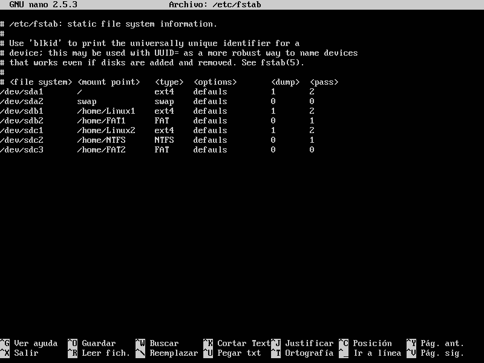

# Ejercicio fstab  
A una máquina virtual de linux añadirle dos discos duros:
- disco A
  - Crear las siguientes particiones:
    - Linux
    - Fat
- disco B
  - Crear las siguientes particiones:
    - Linux
    - NTFS
    - Fat  
fstab:  
  

Para particionar un disco nuevo y formatearlos se utiliza fdisk.  
Modificar el fichero fstab, añadiendo todas las particiones. Las del disco A se montarán manualmente. Las del disco B se montarán automáticamente al arrancar.  

# Ejercicios cron.  
- Cada hora en punto ejecutamos la sincronización horaria y mandamos la salida a /dev/null/  
~~~  
0 * * * * root /usr/sbin/ntpdate > /dev/null  
~~~  
- Programar un trabajo (A) para ejecutarse en el minuto 30 de cada hora de cada día.  
~~~  
30 * * * * root echo A >>  /etc/trabajos 
date >>  /etc/trabajos  
~~~  
- Programar un trabajo (B) para ejecutarse cada día a las 20:30h.  
~~~  
30 20 * * * root echo B >>  /etc/trabajos  
date >>  /etc/trabajos   
~~~ 
- Programar un trabajo (C) para ejecutarse de lunes a viernes a las 20:30h.  
~~~  
30 20 * * 1-5 root echo C >>  /etc/trabajos  
date >>  /etc/trabajos  
~~~ 
- Programar un trabajo (D) para ejecutarse los martes y los jueves a las 20:30h.  
~~~  
30 20 * * 2,4 root echo D >>  /etc/trabajos  
date >>  /etc/trabajos  
~~~ 
- Programar un trabajo (E) para ejecutarse los días 10 y 20 de todos los meses a las 20:30h.  
~~~  
30 20 10,20 * * root echo E >>  /etc/trabajos  
date >>  /etc/trabajos  
~~~ 
- Programar un trabajo (F) para ejecutarse cada 15 minutos.  
~~~  
15,30,45,0 * * * * root echo F >>  /etc/trabajos  
date >>  /etc/trabajos  
~~~ 
- Programar un trabajo (G) para ejecutarse cada día a las 00:00h.  
~~~  
0 0 * * * root echo G >>  /etc/trabajos  
date >>  /etc/trabajos  
~~~ 
- Programar un trabajo (H) para ejecutarse cada primer día de mes a las 00:00h.  
~~~  
0 0 1 * * root echo H >>  /etc/trabajos  
date >>  /etc/trabajos  
~~~ 

El trabajo que se debe ejecutar es:  
Añadir al fichero /etc/trabajos (no existe hay que crearlo) el código del trabajo y la hora de ejecución.  

